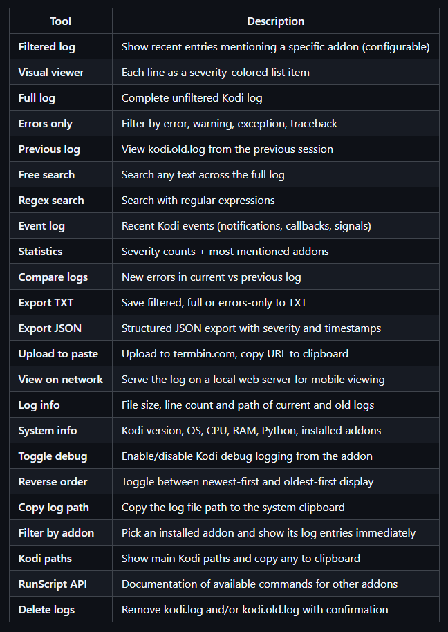

# LoioLog — Advanced Kodi Log Manager

All-in-one Kodi log viewer — filter, search, analyze and share your logs.

## Installation

### Option 1: From Kodi File Manager (Recommended)

1. Go to **Settings → File Manager → Add Source**
2. Enter the URL: `https://loioloio.github.io/loiolog/`
3. Name it `LoioLog Repo` and click OK
4. Go to **Settings → Addons → Install from ZIP**
5. Select `LoioLog Repo` → `repository.loiolog` → `repository.loiolog-1.0.0.zip`
6. Go to **Install from Repository → LoioLog Repository → Programs → LoioLog → Install**

### Option 2: Manual ZIP Install

1. Download `plugin.program.loiolog-1.0.0.zip` from [Releases](https://github.com/loioloio/loiolog/releases)
2. In Kodi: **Settings → Addons → Install from ZIP** → select the downloaded file

## Features

## Settings

- **Filter log by addon**: term to filter log entries
- **Enable sensitive data cleanup**: masks tokens, passwords and API keys in log output
- **Show newest entries first**: reverse display order

## Requirements

- Kodi 19 (Matrix) or newer
- Python 3

Available in English and Spanish.

## Support

[Open an issue](https://github.com/loioloio/loiolog/issues) on GitHub.
